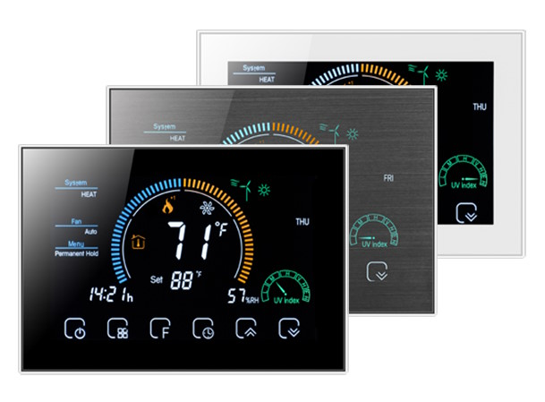
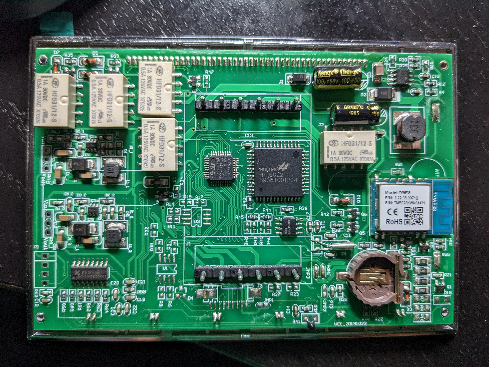
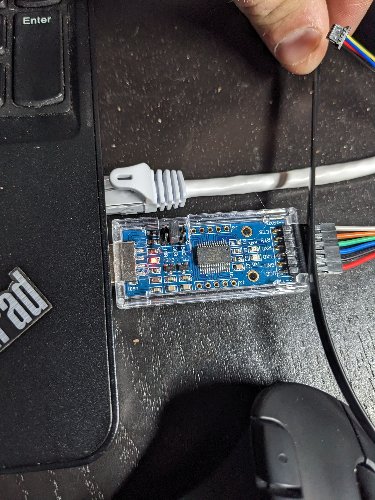
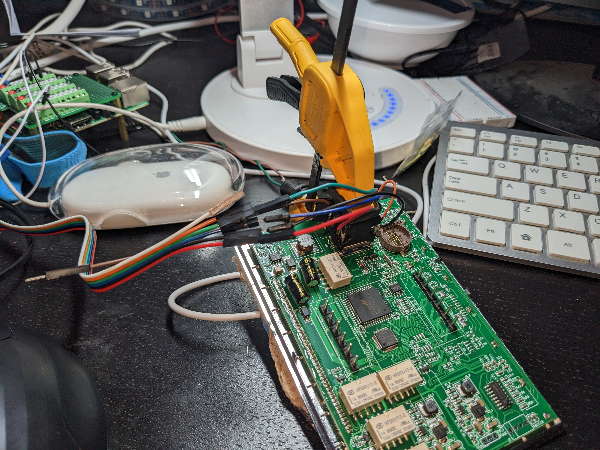
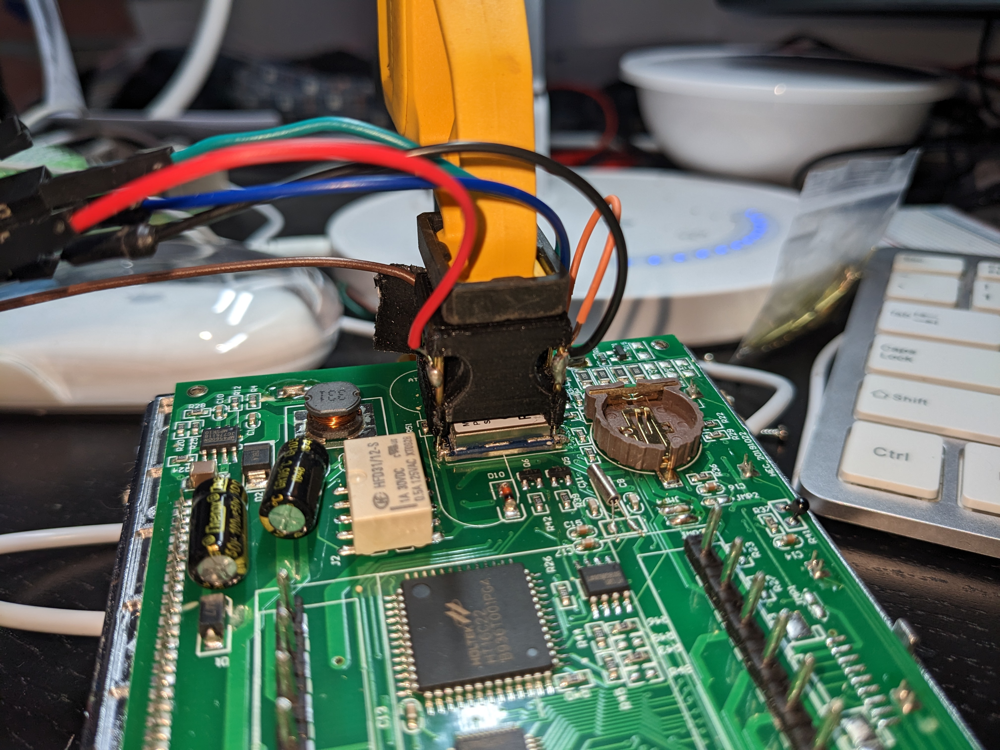
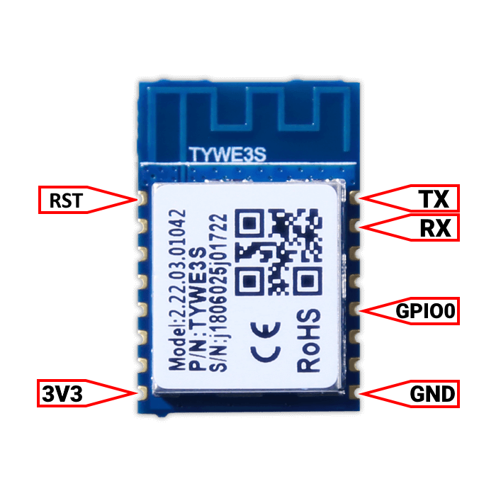
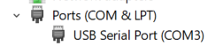

# WThermostat - Forked for BHP-8000

[](https://github.com/mtn220/WThermostatBeca/releases/latest)
[](https://github.com/mtn220/WThermostatBeca/releases)
[](https://github.com/mtn220/WThermostatBeca/releases/latest)

Fork of <https://github.com/fashberg/WThermostatBeca> updated to work specifically with the BHP-8000 thermostat.

## BHP-8000

<details open>
<summary>Images:</summary>


[](docs/images/BHP-8000_board_1.jpg)
Two more images of the board [here](docs/images/BHP-8000_board_2.jpg) and [here](docs/images/BHP-8000_board_3.jpg)
</details>

The BHP-8000 is a WiFi enabled thermostat that runs on a similar principle to the other thermostats that the ThermostatBecaWifi firmware was designed for. It uses the same [Tuya Serial Protocol](https://developer.tuya.com/en/docs/iot/tuya-cloud-universal-serial-port-access-protocol?id=K9hhi0xxtn9cb) to communicate between the ESP8266 based WiFi chip (Tuya TYWE3S) and the MCU. This MCU is different than referenced in the fashberg documentation and importantly, **the mapping of data points between the WiFi chip and the MCU are different.** This firmware replaces the WiFi chip (TYWE3S) firmware, not the code on the MCU.

### Data Point (DP) Mapping

<details open>
<summary>Mapping Table</summary>

|DP|Description|Data Type|Values|
|:----:|:----:|:----:|:----|
|1|Thermostat On/Off|Boolean (0x01)|00 - Off<br />01 - On|
|2|Target Temperature|Integer (0x02)|Degrees F|
|3|Actual Temperature|Integer (0x02)|Degrees F|
|4|Schedule Mode|Enumeration (0x04)|00 - Using Schedule<br />01 - Temporary Hold<br />02 - Permanent Hold<br />03 - Hold Until|
|5|System Mode|Enumeration (0x04)|00 - Cool<br />01 - Heat<br />02 - Off<br />03 - Emergency Heat<br />04 - Auto|
|6|Fan Mode|Boolean (0x01)|00 - Auto<br />01 - On|
|7|Screen Lock|Boolean (0x01)|00 - Not Locked<br />01 - Locked|
|17 (0x11)|Possibly schedule info?|Raw (0x00)|?? |
</details>

## Device-Functions

### JSON structures

The software provides different messages:

1. Thermostat State report (JSON)
2. Schedules (JSON) **(Not Working)**
3. Device (at start of device to let you know the topics and ip)
4. Logs (Plain)

#### 1. Thermostat State report

MQTT State report is provided every 5 minutes, when a parameter is changed or when commanded.

To command a state report, send a message with an empty payload (empty raw payload or empty JSON {}) to `<your_topic>/cmnd/things/thermostat/properties`

State reports are sent to `<your_topic>/stat/things/thermostat/properties`.
The state report is sent with MQTT-retain-flag enabled.

The JSON below shows the format of the state report with an example of some values.
`// Reported but not implemented` means that the property shows up in the state report but shouldn't be used for anything, as it isn't working or properly implemented in this firmware.
```json
{
  "idx":"thermostat_beca",
  "ip":"192.168.0.xxx",
  "firmware":"x.xx",
  "temperature":65,
  "targetTemperature":70,
  "deviceOn":true,
  "schedulesMode":"permanent_hold",
  "holdMode":"manual" // Reported but not implemented
  "ecoMode":false, // Reported but not implemented
  "locked":false,
  "state":"off|heating", // Reported but not implemented
  "floorTemperature":20, // Possibly reported, not implemented
  "fanMode":"auto",
  "systemMode":"cool",
  "mode":"off", // Reported but not implemented
  "action":"off" // Reported but not implemented
}
```

#### 2. Schedules

Not working.

#### 3. Device Report

Not tested.

**MQTT:** At start of device to let you know the topics and ip to `devices/thermostat`  

```json
{
  "url":"http://192.168.0.xxx/things/thermostat",
  "ip":"192.168.0.xxx",
  "topic":"thermostat_beca/things/thermostat"
}
```

#### 4. Logs

Not tested.

If logging is enabled (webgui/mqtt) you will see messages like:

```sh
<your_topic>/tele/log trace: sending heartBeatCommand
<your_topic>/tele/log trace: commandCharsToSerial: 55 aa 00 00 00 00
```

### MQTT Commands

##### Changing Multiple Parameters

Send a JSON with changed parameters to `<your_topic>/cmnd/things/thermostat/properties`.  
For example, send the following to only change the target temperature and the system mode:
```json
{
  "targetTemperature": 72,
  "systemMode": "cool"
}
```

##### Changing Individual Parameters

You also can change single values by sending the value to `<your_topic>/cmnd/things/thermostat/properties/parameterName`. (Not fully tested)

##### MQTT Parameters / Properties

<details open>
<summary>MQTT properties and their possible values:</summary>

|Property|Description|Values or Data Type|Writable|Notes|
|:----:|:----:|:----:|:----:|:----|
|idx|Thermostat identifier|String|No|Set through web interface|
|ip|Thermostat IP address|String|No||
|firmware|Firmware version|String|No||
|temperature|Current temperature|Integer degrees fahrenheit|No|
|targetTemperature|Temperature set point|Integer degrees fahrenheit|Yes|
|deviceOn|Device on/off status|false = Off<br />true = On|Yes|Device can still communicate while turned off|
|schedulesMode|Scheduling mode|"schedule"<br />"temporary_hold"<br />"permanent_hold"<br />"hold_until"<br />|Yes||
|holdMode|Not used|||Not used, should mirror schedulesMode|
|ecoMode|Not used|||Not used|
|locked|Screen lock|false = not locked<br />true = locked|Yes|See random notes below|
|state|Not used|||Not used|
|floorTemperature|Not used|||Not used|
|fanMode|Fan mode|"auto"<br />"on"|Yes||
|systemMode|Thermostat mode|"cool"<br />"heat"<br />"off"<br />"emergency_heat"<br />"auto"|Yes||
|mode|Not used|||Not used|
|action|Not used|||Not used|
</details>
<details>
<summary>Examples using mosquitto_pub</summary>

```sh
# Turn device on
mosquitto_pub -h mqtt -t home/test/cmnd/things/thermostat/properties/deviceOn  -m "true"

# set device to heating
mosquitto_pub -h mqtt -t home/test/cmnd/things/thermostat/properties/systemMode  -m "heat"

# set target temperature
mosquitto_pub -h mqtt -t home/test/cmnd/things/thermostat/properties/targetTemperature  -m "72"

# set target temperature (json)
mosquitto_pub -h mqtt -t home/test/cmnd/things/thermostat/properties -m '{"targetTemperature":72}'

# set target temperature and mode (json)
mosquitto_pub -h mqtt -t home/test/cmnd/things/thermostat/properties -m '{"targetTemperature":68,"systemMode":heat}'

# just request properties
mosquitto_pub -h mqtt  -t home/test/cmnd/things/thermostat/properties -n

# disable MQTT logging (not tested)
mosquitto_pub -h mqtt -t home/test/cmnd/things/logging/properties/logLevel -m "silent"

# set to level trace (available: silent|fatal|error|warning|notice|trace|verbose) (not tested)
mosquitto_pub -h mqtt -t home/test/cmnd/things/logging/properties/logLevel -m "trace"

# send MCU command by MQTT
mosquitto_pub -t "home/test/cmnd/things/thermostat/mcucommand" -m "55 aa 00 1c 00 08 01 14 09 0c 10 30 0f 06"

```
</details>

##### Sending the MCU Commands

This firmware can send raw commands to the MCU via MQTT.

Send the command to `<your_topic>/cmnd/things/thermostat/mcucommand`

The command should be in hex with spaces between every two bytes. It should include the header (55 AA) but not the checksum. The checksum is added automatically before the command is sent to the MCU.

The web log will report that an unknown command was received anytime this functionality is used. Ignore this. It is a side effect of how it was implemented.

<details open>
<summary>Command examples:</summary>

```
// Change the systemMode to "off"
55 AA 00 06 00 05 05 04 00 01 02

// Change the schedulesMode to "temporary_hold"
55 AA 00 06 00 05 04 04 00 01 01

// Lock the screen
55 AA 00 06 00 05 07 01 00 01 01

// Request all DP from the MCU (can view on the web log viewer)
55 AA 00 08 00 00
```
</details>

## Random Notes

* Locking the thermostat locks all the physical buttons except for the power button. Turning the thermostat power off and on unlocks the buttons, but doesn't change the "locked" status within the MCU. In this firmware, I set it up to update the MCU parameter as needed anytime the device is turned off to keep the parameter in sync.
* The built-in schedules might be able to be implemented, but I didn't put the time into it. Check out DP 17 (0x11), that might be it. Here is an example of the data that comes from that data point: `55 aa 03 07 00 74 11 00 00 70 01 68 02 d0 01 e0 02 d0 02 b2 02 d0 03 2a 02 d0 01 68 02 d0 01 e0 02 d0 02 b2 02 d0 03 2a 02 d0 01 68 02 d0 01 e0 02 d0 03 fc 02 d0 05 28 02 6c 01 68 02 d0 01 e0 02 d0 02 b2 02 d0 03 2a 02 d0 01 68 02 d0 0`
* There is a lot more information at the original firmware <https://github.com/fashberg/WThermostatBeca> and <https://github.com/klausahrenberg/WThermostatBeca>.
  * Check out the docs folder of these for a lot of info that isn't contained in the readme files.

## Flashing / Updating

For the intial upload, you can try Tuya-Convert, but there is a decent chance it won't work due to updated firmware not being compatible. (2/3 that we tried didn't work.)

To program the device without Tuya-Convert, follow the directions from the fashberg fork for flashing the device manualy. <https://github.com/fashberg/WThermostatBeca/blob/master/Flashing.md>. A pdf print of that page is saved [here](/docs/fashberg_WThermostatBeca-ThermostatBeca_Flashing.md.pdf) just in case. 

### Flashing Supplimental Info

##### Materials I used for flashing:

* USB to TTL converter - [Amazon page](https://www.amazon.com/DSD-TECH-SH-U09C2-Debugging-Programming/dp/B07TXVRQ7V/ref=sr_1_3?keywords=DSD+TECH+SH-U09C2&qid=1679443475&sr=8-3)
* esp8266 programming jig - <https://www.thingiverse.com/thing:4547369>
* Wires to connect between pogo jig and USB to Serial converter
* Clamp of some sort to hold pogo jig down

##### Pictures of setup

[](docs/images/USBtoSerial.jpg)
[](docs/images/SetupWide.jpg)
[](docs/images/SetupClose.jpg)

##### Connection Pinout

[](docs/images/TYWE3S_pinout.png)

| USB to Serial Pin | Wire Color (my setup) | TYWE3S Pin | Notes |
|---|---|---|---|
| VCC | Red | 3V3 |  |
| GND | Black | GND |  |
| TXD | Blue | RX |  |
| RXD | Green | TX |  |
|  | Orange | GPIO0 | Connected to GND on Jig. This puts the TYWE3S in programming mode. |
|  | Brown | RST | Not Connected. Can be connected to 3V3 to prevent resetting, but it has an internal pullup so this shouldn't be necessary. Connect to GND to reset. |

##### Flashing Commands

I used windows so these notes are specific to that, but may be helpful for other systems with appropriate adaptations.

With Windows 10, I didn't need to manually install any drivers for the USB to Serial adapter that I used. The instructions included with the adapter do have a link to some drivers if it doesn't work for you.

Here are the flashing commands I used with some notes about the commands below:

```
./esptool -p COM3 -b 460800 read_flash 0x00000 0x100000 originalFirmware1M.bin
./esptool -p COM3 erase_flash
./esptool -p COM3 write_flash -fs 1MB 0x0 wthermostat-1.22.bhp8k.1.bin
```

* COM3 is the COM port where my device showed up in windows. It may be different for your. Goto device manager and find what port yours is connected at. This will also show if the device drivers aren't installed properly.

* The commands use esptool, which can be downloaded at <https://github.com/espressif/esptool/releases>. I downloaded the latest for my system, which was 4.5.1 at the time.
* I used a Git Bash terminal in windows to run the commands above. If you are using command prompt, you will need to change `./esptool` to `esptool.exe`

##### Other Notes

* Getting the jig lined up with the pogo pins touching just right was tedious, but doable and less risky than soldering IMO.
* Put a piece of cardboard or some other padding on the screen side of the thermostat before clamping the jig down. **Don't clamp too tight or you could crack the display!**

## Configuration and Web Interface

After flashing, I used the instructions from fashberg (<https://github.com/fashberg/WThermostatBeca/blob/master/Configuration.md> or [printed to pdf](/docs/fashberg_WThermostatBeca-ThermostatBeca_Configuration.md.pdf)) to configure the thermostat with the following settings needed for the BHP-8000

* **Set the thermostat model to BAC-002-ALW**
* **Set the temperature precision to 1.0**


## Build this firmware from source

For building from sources and coding i suggest VS Code and PlatformIO.

### Visual Studio Code: Install and Prepare to build

* Install [Visual Studio Code](]https://code.visualstudio.com/) and [PlatformIO](https://platformio.org/).
* Type:

```sh
git clone https://github.com/mtn220/WThermostatBeca
cd WThermostatBeca
# download dependant library WAdapter
git submodule init
git submodule update
```

* Open the folder 'WThermostatBeca' in VS Code
* Go to PlatformIO Alien Icon on the left
* Open in Tree "wthermostat" and click General/Build
  * Binary Firmware can be found in build_output/firmware/wthermostat-1.22.bhp8k.x.bin (or -debug or -minimal)

All dependant arduino-libraries (DNSServer, EEPROM (for esp8266), ESP8266HTTPClient, ESP8266mDNS, AsyncWebServer, ESP8266WiFi, Hash, NTPClient, Time.) will be downloaded automatically (defined in platform.ini) and the necessary WAdapter library from <https://github.com/fashberg/WAdapter> (git submodule).

#### Environments wthermostat / wthermostat-minimal / wthermostat-debug and bin.gz

There are 3 environments:

1. wthermostat: this is the default production environment.

2. wthermostat-minimal: (untested) this is the minimal version. No MQTT and no Thermostat Support, meant for OTA Upgrading when standard is too small. After flashing minimal do an upgrade to normal.

3. wthermostat-debug: (untested) this is the debug/development version.  DO NOT FLASH TO THERMOSTAT HARDWARE! There is debugging output to serial interface which will confuse Thermostat-MCU. Upload to USB-Connected development ESP8266 board (Node MCU or Wemos D1 Mini pro) and monitor the output in vscode/pio-monitor.

bin vs bin.gz: You can directly upload a gzipped (compressed) firmware via OTA